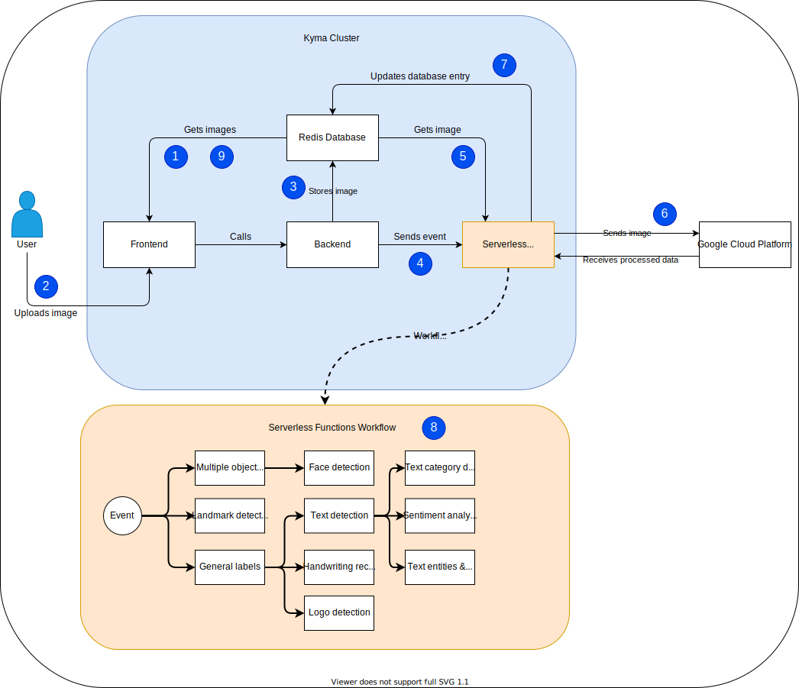

#Architecture

The diagram below presents the basic workflow of the project.

1. Frontend gets all current images stored in database and displays them on feed.
2. User uploads an image using frontend's UI.
3. Image is stored in the database and displayed on the feed.
4. Backend sends an event containing the database ID used to access the image.
5. Serverless functions are triggered by the event and get the image from the database using given ID.
6. Functions send the image in base64 to Google Cloud Platform for processing.
7. Database entry is updated with newly obtained image details.
8. Depending of the details content a new event may be sent triggering next functions.
9. Upon clicking a single image in frontend UI a details page is displayed listing all the information recieved from the Google Cloud Platform.

Initial event triggers `Multiple object detection, Landmark detection` and `General labels` functions. The remaining ones get triggered based on the contents of response recieved from Google Cloud Platform.

| Content required | Serverless functions triggered |
|-----------|-------------|
| Text/Font (label) | Text detection |
| Handwriting | Handwriting detection |
| Logo | Logo detection|
| Text (string) | Text category detection, Sentiment detection, Text entities and Entity sentiment |
| Person (object) | Face detection |